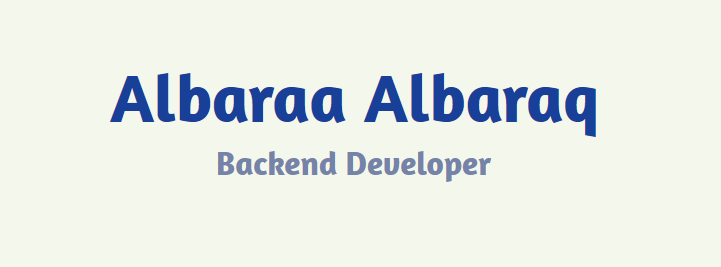

### ✨ About Me
```json
{
 "name": "Albaraa Albaraq",
 "profile": {
   "occupation": "Backend Developer",
   "education": "Bachelor's Degree in Information Technology",
   "currentlyLearning": "SOLID Principles & Advanced ASP.NET Core"
 },
 "skills": [
   "C++", "C#", ".NET Framework", "ASP.NET Core", "WinForms",
   "ADO.NET", "SQL Server", "T-SQL", "RESTful API",
   "Git/GitHub", "3-Tier Architecture", "Event-Driven Programming",
   "Functional Programming", "Object-Oriented Programming"
 ]
}
```
### 📫 Reach Out 
→ Telegram: [@ALbaraALbaraq](https://t.me/ALbaraALbaraq)

→ LinkedIn: [Albaraa Albaraq](linkedin.com/in/albaraa-albaraq-6ba098386)

→ Email: albaraa.albaraq@gmail.com

